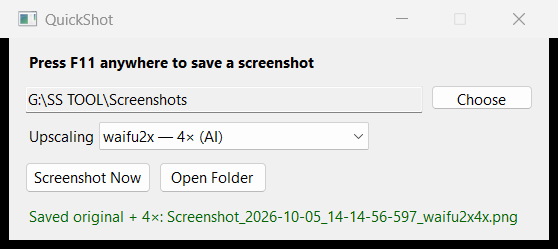
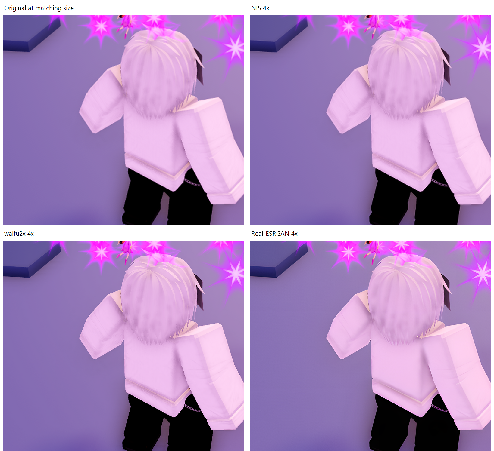

# QuickShot

Press **F11** to save a screenshot. QuickShot runs in the Windows system tray
and lets you choose where to save your pictures.



## Download and run

1. Download **QuickShot-win-x64.zip** from the [latest release](https://github.com/venkey123456789/QuickShot/releases/latest).
2. Extract the whole ZIP. Keep the `engines` folder next to `QuickShot.exe`.
3. Install the [.NET 9 Desktop Runtime](https://dotnet.microsoft.com/download/dotnet/9.0) if needed.
4. Open `QuickShot.exe` and accept the Windows admin prompt.
5. Click **Choose** to pick a save folder, or use the default `Screenshots` folder next to the EXE.
6. Click **Screenshot Now**, press **F11**, or use the tray menu to take a screenshot.

The app remembers your folder. You can change it at any time.
If you have more than one monitor, QuickShot saves the full desktop in one PNG.

## Make a larger copy

Choose a mode in **Upscaling**. QuickShot saves the original first, then saves
an extra 4× copy. Choose **Off** to save only the original.

| Mode | Extra file name ends with | What it uses |
|---|---|---|
| AMD FSR 1 | `_FSR4x.png` | A fast resize and sharpening filter |
| NVIDIA Image Scaling | `_NIS4x.png` | NVIDIA's image filter; also tested on AMD |
| waifu2x | `_waifu2x4x.png` | A local AI model, with noise removal off |
| Real-ESRGAN | `_RealESRGAN4x.png` | A local AI model for general images |

**4× means four times the width and height.** A 3440 × 1440 screenshot becomes
13760 × 5760. That is 16 times as many pixels, so it takes more memory and disk
space. The app remembers your choice. It starts with Off on a fresh install.
Old 2× settings also reset to Off.

The original is always kept. If an extra copy fails, the app shows an error
and leaves the original alone. One image can be processed while one waits.
If the queue is full, new captures still save their originals.
Closing the app cancels unfinished extra copies.

Everything runs on your PC. There are no accounts, uploads, servers or
per-image fees. The AI modes need the bundled `engines` folder. FSR and NIS
work without it.

## See the difference



This shows the same part of an image at matching display sizes. AI can make
edges look smoother, but it can also change text and small details. A bigger
image is not proof that missing detail has been recovered. These modes do
not increase game FPS.

[See more images and test evidence](docs/IMAGE-EXAMPLES.md).

## What was tested

- 22 local tests passed, including the real FSR, NIS and AI processing.
- Screenshot Now, F11 and tray capture worked with the three new modes.
- GitHub's Windows build, basic tests and publish checks passed.
- GPU tests ran on an RX 7900 XTX. Other GPU models have not been tested.

[Test details and measured times](VERIFICATION.md).

## Limits

- FSR and NIS need Direct3D 11 hardware with feature level 11.0 or higher.
- The AI modes need a graphics driver that supports Vulkan.
- Extra copies cannot exceed 16,384 pixels on either side or 80 million pixels in total.
- An AI job stops after 15 minutes if it has not finished.
- Processing can compete with a running game for GPU power.
- This version handles SDR screenshots. It does not capture or rebuild HDR.
- Protected video and some fullscreen or anti-cheat games may block capture. Try borderless or windowed mode.
- The admin prompt lets the F11 listener work when an elevated game has focus.

NIS is not DLSS. SUPIR and diffusion models are not included.

## Build from source

You need Windows and the .NET 9 SDK.

```powershell
dotnet build .\QuickShot.csproj -c Release
dotnet run --project .\Tests\QuickShot.Tests.csproj -c Release -- --gpu
```

Install the AI tools and run all tests:

```powershell
.\scripts\Install-Engines.ps1
$env:QUICKSHOT_ENGINE_ROOT = "$PWD\engines"
dotnet run --project .\Tests\QuickShot.Tests.csproj -c Release -- --gpu --ai
```

The setup script downloads about 81 MB from the original projects. It checks
the files against the saved SHA256 hashes. The finished app needs no downloads.

Build the complete ZIP, including AI models and docs:

```powershell
.\scripts\Publish-Windows.ps1
```

To publish only the EXE:

```powershell
dotnet publish .\QuickShot.csproj -c Release -r win-x64 --self-contained false `
  -p:PublishSingleFile=true -p:DebugSymbols=false -p:DebugType=None
```

FSR and NIS shader files are built into the EXE. The AI models stay in `engines`.

## License

QuickShot uses the [MIT license](LICENSE). See
[third-party notices](THIRD-PARTY-NOTICES.txt) for the tools and models it uses.
