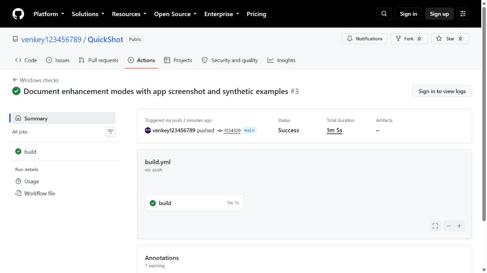

# Images and test evidence

## QuickShot app


Choose a save folder and an upscaling mode. The status line tells you when
an original and its larger copy have been saved.

## Real image comparison


This is the exact `comparison.png` chosen by the project owner. It shows
matching crops from the original and the real NIS, waifu2x and Real-ESRGAN
outputs. FSR is not shown in this image.

Look at the hair and clothing. NIS keeps more of the source texture here.
The AI modes smooth and change some fine details. This one example does not
prove that one mode is always better. Click the image to view it at full size.

## Test results

[Read the local test output](evidence/gpu-ai-tests.txt): **22 passed, 0 failed**.
The tests were rerun on 5 October 2026 on an RX 7900 XTX. The command exited 0.

```powershell
dotnet run --project Tests/QuickShot.Tests.csproj -c Release -- --gpu --ai
```

These tests run the real shaders and both AI tools. They also check saved
settings, image sizes, colors, queue limits and error handling.

[Read the installed app test log](evidence/installed-ui-results.txt). It shows:

- waifu2x worked through Screenshot Now.
- Real-ESRGAN worked through F11 while the app was minimized.
- NIS worked through the tray's Screenshot now command.

Each test saved a 3440 × 1440 original and a 13760 × 5760 extra copy. The log
keeps the first failed attempts to control the hidden tray icon and the
successful retry. Those were test-helper problems, not failed app captures.
These app checks were done earlier; they were not rerun for this text update.

## GitHub checks



[Open this GitHub run](https://github.com/venkey123456789/QuickShot/actions/runs/37285831283).
The build, 15 basic tests and single-file publish passed for commit `f354309`.
This is a saved image of that run. GPU tests ran on the local PC, not GitHub.

[Read the test report](../VERIFICATION.md) for timings and limits.

## Small test images

These generated patterns check colors, diagonal lines and small text. They
are not photos or game screenshots. Each 173 × 93 input became 692 × 372.
The original below is enlarged by the browser to make comparison easier.

### Original


### AMD FSR 1 — 4×


### NVIDIA Image Scaling — 4×


### waifu2x — 4×


### Real-ESRGAN — 4×


No images from the `Screenshots` folder were added for this page. The real
comparison above was copied from the separate file chosen by the owner.
