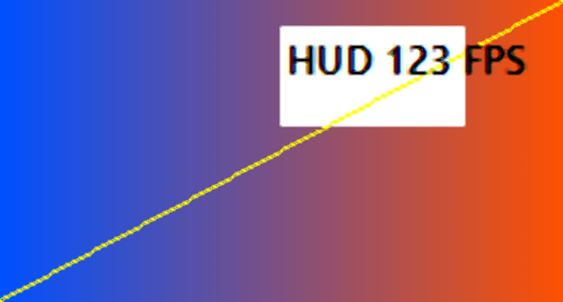
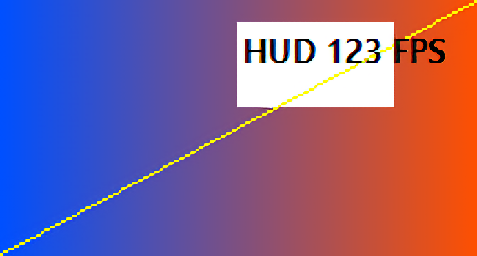
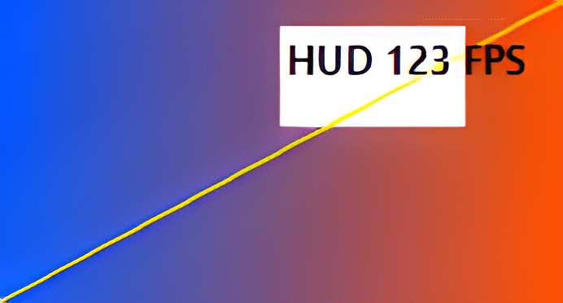

# Interface and enhancement examples

The interface image is a capture of the installed QuickShot window only.
No images from the user's Screenshots folder are included here.

## Synthetic comparison

The source below was generated by `TestProgram.Fixture(173, 93)` in
`Tests/Program.cs`. It contains a color gradient, a diagonal edge and HUD-style
text. Each enhanced image is the actual output of its named method at
692 × 372 pixels. This is a small functional example, not a representative
photo or game-quality benchmark. AI processing can alter text and edges.

The images below share the same display width for comparison. Open an image
to inspect its original pixels; browser scaling also affects the preview.

### Original — 173 × 93

### AMD FSR 1 — 4×

### NVIDIA Image Scaling — 4×

### waifu2x — 4×

### Real-ESRGAN — 4×

These are outputs of the pinned components documented in
[the verification report](../VERIFICATION.md). No restoration or image-generation
tool was used to change the examples or the interface capture.
